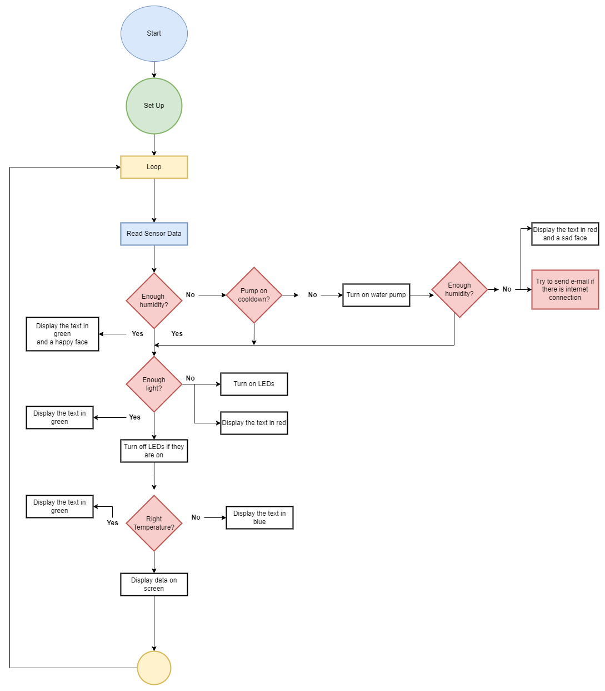

# **BotaniTalk**

This is a work-in-progress university project for the _Interfaces and Peripherals_ course.

It is a smart plant box equipped with sensors for monitoring the soil humidity and environmental light, and will try to help the plant grow healthy by automatically providing it with water and UV light when necessary.

It has an OLED screen that shows humidity, light, and temperature information as well as a little face animation so you know the status of your plant at a first glance.

It can connect to the internet and store statistics data from the sensors and can notify you through e-mail if there's no water left in its tank or in case of other unhappy events.

## Proposed Features

- Collect data about soil humidity, temperature and environmental light
- UV LEDs for when there is no natural light available
- Water tank and pump for when the soil gets dry
- Display screen for showing information
- E-mail notifications

## Software Diagram (WIP)

The software diagram can be found in the [docs](https://github.com/andreeabrezuica/Botani-Talk/tree/main/docs) folder. In order to edit it, you need to open it on [diagrams.net](https://app.diagrams.net/?src=about) or using the `Draw.io Integration` extension for VS Code.

## Guides and resources

### Some useful, general documentation

- [Git Explained in 100 Seconds](https://youtu.be/hwP7WQkmECE), a short video visualizing the very basics of how the Git versioning system works.
- [How to Use Git and Github](https://youtu.be/HkdAHXoRtos), a comprehensive guide with everything you need to know about, including the project workflow, commiting and pushing changes, merging branches and more. The command-line is used in the video, but you can use a GUI as well.
- [Git Cheat Sheet](https://education.github.com/git-cheat-sheet-education.pdf) with the all the commands you need to know (don't try to memorise them, you should use a GUI anyway, but it's useful to know what you can do ahead of time)
- [Markdown Documentation](https://docs.github.com/en/get-started/writing-on-github/getting-started-with-writing-and-formatting-on-github/basic-writing-and-formatting-syntax), for updating `.md` files like this `README.md`.
  > **Note:** [Visual Studio Code](https://code.visualstudio.com/download) and most IDEs have a handy Markdown Previewer, so it might be useful to set it as the main app to open `.md` files.

### Software needed for contribution

- [Git](https://git-scm.com/download/win) (only command-line)
- _[optional but highly recommended]_ Any GUI for Git would be useful (you can still use the command-line if you want). [TortoiseGit](https://tortoisegit.org/) is a good option because it integrates with the Windows Shell
  > **Note:** If you want to use TortoiseGit, you need to install Git as well, as TortoiseGit is just a graphical interface for Git; it writes and executes the Git commands for you.
- [Arduino IDE](https://www.arduino.cc/en/software) 2.2.1
